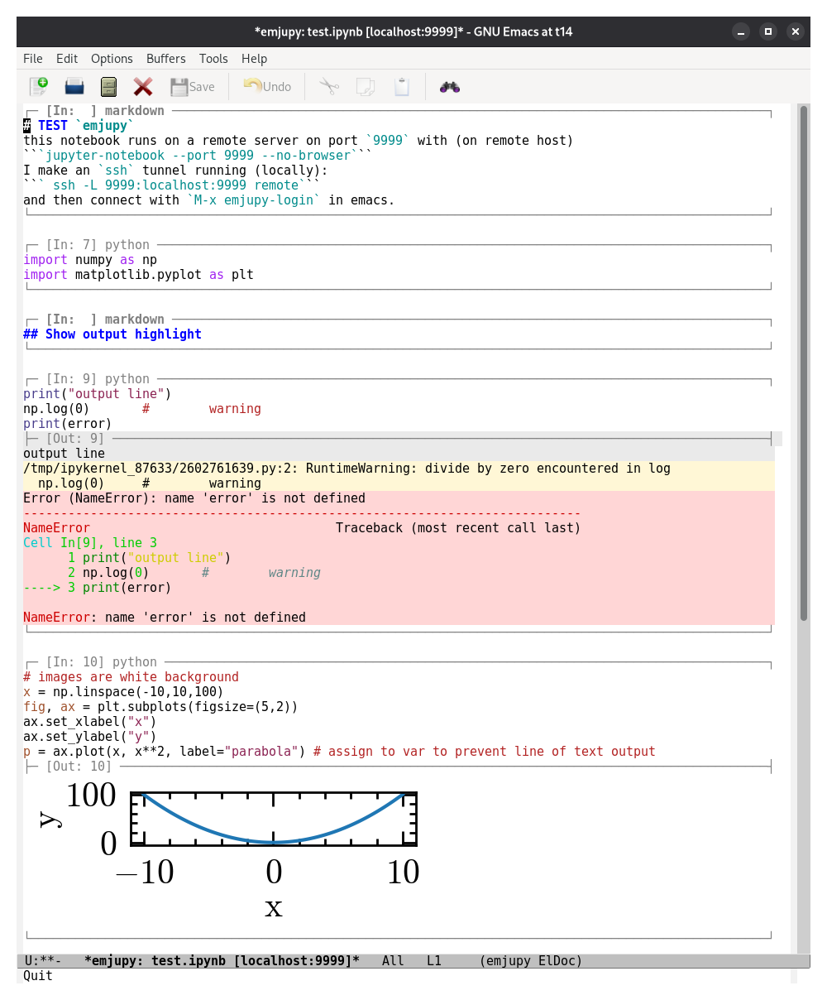
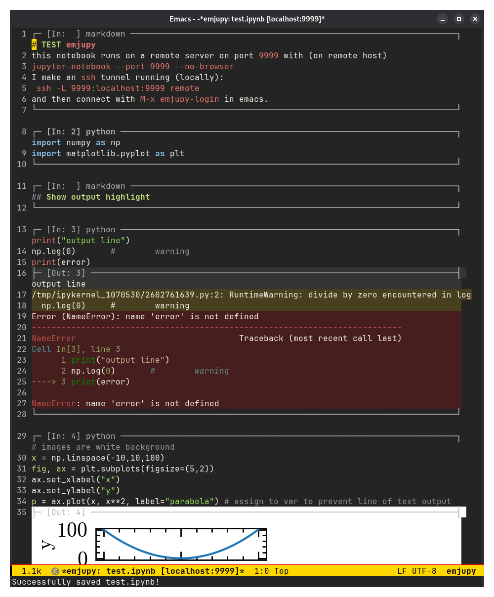

#+TITLE: Emjupy
#+author: Mathieu Renzo w/ various LLMs (Claude Sonnet, Opus, Gemini, chatGPT)

[[https://github.com/mathren/emjupy/actions/workflows/build-package.yml][https://github.com/mathren/emjupy/actions/workflows/build-package.yml/badge.svg]]

#+CAPTION: Python Jupyter Notebook in Emacs.
#+ATTR_HTML: :width 50%
[[./images/emjupy-logo.png]]

Jupyter notebooks with remote kernel execution using emacs built-ins
(=eglot= and =tramp=, completion framework the way you like and
configured, e.g., =vertico= + =corfu= + =orderless=) while maintaining
compatibility with standard =*.ipynb= for sharing with non-emacs users.

* Screenshots

On a plain emacs installation, you should see something like:
#+CAPTION: [[./test_notebook/test.ipynb][Simple notebook]] rendering in a fresh emacs with no customization. Screenshot may be out of date.
#+DOWNLOADED: screenshot @ 2026-09-06 12:42:46

This is what the same notebook looks like with =wombat= theme in my
setup:
#+CAPTION: simple notebook rendering in [[https://github.com/mathren/emacs_mathren][my emacs]] with a slightly modified =wombat= dark theme.
#+DOWNLOADED: screenshot @ 2026-09-06 12:49:08

*N.B.:* Screenshot may be out of date, for instance colored lines do not
exceed cell border anymore.

* Features
- persistent kernel session (to load large dataset once and re-use
  them)
- remote or local kernel (just needs port and token)
- in-line rendering of output including images
- automatic loading of kernel from port, python environment (including
  for =eglot= if =python-lsp-server= is listed in the environment)
- resilient to connection drops (remote kernel keeps running,
  reconnect emacs)
- =ein=-like workflow and key bindings
- notebook (open and available) and kernel list with =emjupy-list-*=,
  analogous to =ein:notebooklist=

* Try it with =emacs -Q=
To test this in an isolated environment without touching your current config:

1. Launch a =jupyter-notebook= on a known =<PORT>=:
   #+begin_src bash
     jupyter-notebook --port=<PORT> --no-browser  --IdentityProvider.token=abc
   #+end_src
   This can optionally be done on a remote machine.

2. *Optional*: if the server is on a remote machine, create a tunnel to
   it running on your local machine:
   #+begin_src bash
     ssh -L <PORT>:localhost:<PORT> <remote machine>
   #+end_src

3. Launch Emacs with:
   #+begin_src bash
     emacs -Q -L . -l quicktry.el --eval '(emjupy-login)'
   #+end_src
   where =-Q= ignores your setup of emacs, =-L .= installs *locally* the
   requirements (to not clutter your emacs installation).

4. Follow the prompt in the minibuffer (bottom) area. The
   token/password is =abc= provided in 1., only asked if the server
   actually needs one. =emjupy= adopts the kernel already running behind
   that port and shows you the notebook list; picking one drops you
   straight into the live REPL (see screenshots above).

* Installation

Clone this repo, add to =load-path=, and load it with these lines in
your =init.el= or similar:

#+BEGIN_SRC elisp
  (add-to-list 'load-path "/path/to/emjupy")
  (require 'emjupy)
#+END_SRC

Or with =use-package= (remove the =:rev :newest= line to use the latest
release rather than the latest commit):

#+BEGIN_SRC elisp
  (use-package emjupy
    :vc (:url "https://github.com/mathren/emjupy"
         :rev :newest ;; latest commit, if commented, latest release
         )
    :config
    (setq emjupy-render-latex t))
#+END_SRC

Alternatively, use =install-package-file= giving it the tarball created
by gitHub actions.

* Keybindings

** =emjupy-mode= (notebook buffers)

| Key         | Command                           | Effect                                                             |
|-------------+-----------------------------------+--------------------------------------------------------------------|
| =C-c C-c=     | =emjupy-execute-cell-and-goto-next= | Execute, then go to the next cell (making one if this is the last) |
| =S-<return>=  | =emjupy-execute-cell-at-point=      | Execute, leaving point where it is                                 |
| =C-c C-e=     | =emjupy-execute-cell-at-point=      | Same as =S-<return>=, for terminals that cannot send it              |
| =C-c C-a=     | =emjupy-insert-cell-above=          | Insert a new code cell above the current one                       |
| =C-c C-b=     | =emjupy-insert-cell-below=          | Insert a new code cell below the current one                       |
| =C-c C-k=     | =emjupy-delete-cell=                | Delete the cell at point                                           |
| =C-c C-l=     | =emjupy-clear-cell-output=          | Discard this cell's output                                         |
| =C-c C-u C-l= | =emjupy-clear-all-outputs=          | Discard every cell's output (asks first)                           |
| =C-c C-s=     | =emjupy-split-cell=                 | Split the cell at point in two (clears both outputs)               |
| =C-c C-j=     | =emjupy-join-cell-above=            | Merge this cell into the one above (clears both outputs)           |
| =C-c C-w=     | =emjupy-copy-cell=                  | Copy the cell, without its output                                  |
| =C-c C-y=     | =emjupy-yank-cell=                  | Insert the copied cell below, unrun                                |
| =C-c C-t=     | =emjupy-cycle-cell-type=            | Toggle the cell between code and markdown                          |
| =C-c <up>=    | =emjupy-move-cell-up=               | Move the cell, and its output, one position earlier                |
| =C-c <down>=  | =emjupy-move-cell-down=             | Move the cell, and its output, one position later                  |
| =C-c <prior>= | =emjupy-beginning-of-cell=          | Go to the start of this cell                                       |
| =M-<prior>=   | =emjupy-beginning-of-previous-cell= | Go to the start of the previous cell                               |
| =M-<next>=    | =emjupy-end-of-previous-cell=       | Go to the end of the previous cell                                 |
| =M-<up>=      | =emjupy-beginning-of-next-cell=     | Go to the start of the next cell                                   |
| =M-<down>=    | =emjupy-end-of-next-cell=           | Go to the end of the next cell                                     |
| =C-c <next>=  | =emjupy-end-of-cell=                | Go to the end of this cell's source                                |
| =C-c C-n=     | =emjupy-next-cell=                  | Move point to the next cell                                        |
| =C-c C-p=     | =emjupy-previous-cell=              | Move point to the previous cell                                    |
| =C-c '=       | =emjupy-edit-cell-externally=       | Edit the cell in the shadow buffer in a real major mode            |
| =C-x C-s=     | =emjupy-save-notebook=              | Write the notebook back to the server as nbformat v4               |
| =C-c C-z=     | =emjupy-connect-kernel-interactive= | Pick a running kernel or spawn one, for this notebook only         |
| =C-c C-x C-r= | =emjupy-restart-kernel=             | Restart this notebook's kernel; other notebooks are untouched      |
| =C-c C-x C-c= | =emjupy-reconnect-kernel=           | Reopen the socket to the same kernel after a drop; state survives  |
| =C-c C-x b=   | =emjupy-switch-notebook=            | Switch to another open notebook, labelled by server                |
| =C-c C-x s=   | =emjupy-status=                     | List every open notebook with its server and kernel                |
| =C-c C-x l=   | =emjupy-login=                      | Log in to another server (another ssh tunnel)                      |
| =C-c C-x C-e= | =emjupy-export-py=                  | Export the notebook as a plain .py file                            |
| =C-c C-x C-l= | =emjupy-re-render=                  | Redraw the notebook from the cells                                 |

Each command has exactly one binding, so =C-h m= is a list of what emjupy
does rather than a wall of synonyms.  The one exception is Shift-RET,
registered in both spellings because terminals disagree about which they
send.

** =emjupy-shadow-edit-mode= (the =C-c '= buffer)

| Key     | Command                   | Effect                                              |
|---------+---------------------------+-----------------------------------------------------|
| =C-c C-c= | =emjupy-commit-shadow-edit= | Write edits back into the notebook cells and return |
| =C-c '=   | =emjupy-commit-shadow-edit= | Same as =C-c C-c=                                     |
| =C-c C-k= | =emjupy-abort-shadow-edit=  | Discard edits and return to the notebook            |

Note that =C-c C-k= means /delete cell/ in the notebook but /abort edit/ in
the shadow buffer, while =C-c C-c= and =C-c '= behave the same in both.

** Unbound commands (=M-x= only)

| Command                   | Effect                                           |
|---------------------------+--------------------------------------------------|
| =emjupy-open-notebook=      | Open a notebook by path on a given server        |
| =emjupy-list-notebooks=     | Prompt with the server's notebook list           |
| =emjupy-create-notebook=    | Create a new blank notebook on the server        |
| =emjupy-refresh-appearance= | Re-derive page colours from the theme and redraw |

Completion (=M-TAB=) and eldoc need no =emjupy= binding: they are wired into
the standard hooks and reach the language server through the shadow buffer
automatically.

* Building & development

=emjupy= is a multi-file Emacs package. To build a tar and install it:

#+begin_src bash
make package                 # -> emjupy-0.1.0.tar
make install                 # package-install-file into your Emacs
#+end_src

and install from Emacs: =M-x package-install-file RET emjupy-0.1.0.tar RET=.

The only external dependency is =websocket= (1.15+); Emacs 29.1+ is
required. =emjupy-login= is autoloaded, so =M-x emjupy-login= works
without any =require=.

** Source layout

| File               | Contains                                                |
|--------------------+---------------------------------------------------------|
| =emjupy.el=          | major mode, keymap, entry point                         |
| =emjupy-core.el=     | structs, state, server registry, lookups                |
| =emjupy-http.el=     | REST transport, URL/scheme/base-path parsing            |
| =emjupy-render.el=   | faces, page colours, cell outlines, syntax highlighting |
| =emjupy-cells.el=    | buffer<->struct syncing and cell editing commands       |
| =emjupy-kernel.el=   | kernel WebSocket, execution, message routing            |
| =emjupy-notebook.el= | login/session management, .ipynb parse and serialize    |
| =emjupy-eglot.el=    | shadow buffer, completion, eldoc                        |
| =emjupy-pkg.el=      | package metadata                                        |

Dependencies run one way: =core -> render -> cells -> kernel -> notebook=, with
=eglot= on top of =cells=. The two genuine cycles (=emjupy-mode= and
=emjupy--rerender-notebook=) are runtime-only and marked with
=declare-function=.

** Makefile targets

| Target       | Effect                                                  |
|--------------+---------------------------------------------------------|
| =make compile= | byte-compile all sources in dependency order            |
| =make test=    | run the suite (integration tests skip without a server) |
| =make check=   | same, with the integration environment set              |
| =make package= | build =emjupy-VERSION.tar=                                |
| =make install= | install that tar via =package-install-file=               |
| =make clean=   | remove =.elc= files and the tar                           |

** Unit tests

The self-contained suite requires only =websocket=:

#+begin_src bash
emacs -batch -Q -L . -l emjupy-run-tests.el
#+end_src

=websocket= is resolved from =load-path= first, then from
=EMJUPY_WEBSOCKET_DIR=, and only then from GNU ELPA -- so the suite
also runs offline / in CI:

#+begin_src bash
EMJUPY_WEBSOCKET_DIR=/path/to/emacs-websocket \
  emacs -batch -Q -L . -l emjupy-run-tests.el
#+end_src

** Integration tests (real server, real kernel, real LSP)

=emjupy-integration-test.el= talks to a live Jupyter server and runs
real Python in a real kernel. These are opt-in and =ert-skip= unless
the environment points at a running server, so the default run stays
fast and hermetic.

Some things only break against a live server -- an image arriving that
this Emacs cannot display, a WebSocket URL that drops its base path, a
saved notebook no other tool will open -- so they are worth running
before trusting a change.

| Variable           | Meaning                                                   |
|--------------------+-----------------------------------------------------------|
| =EMJUPY_TEST_URL=    | =host:port= of a running server (the LOCAL end of a tunnel) |
| =EMJUPY_TEST_TOKEN=  | its token                                                 |
| =EMJUPY_TEST_ROOT=   | server root dir, for the nbformat-validation test         |
| =EMJUPY_TEST_URL2=   | a SECOND server, for the multi-server tests               |
| =EMJUPY_TEST_TOKEN2= | its token (defaults to =EMJUPY_TEST_TOKEN=)                 |

To exercise the *remote* path, point =EMJUPY_TEST_URL= at the local end
of an ssh tunnel rather than at the server directly:

#+begin_src bash
# server side: jupyter listens only on loopback
jupyter server --no-browser --port=8888 --ip=127.0.0.1 --IdentityProvider.token=abc

# client side: forward a local port through ssh
ssh -N -L 18888:127.0.0.1:8888 user@remote-host &

EMJUPY_TEST_URL=127.0.0.1:18888 EMJUPY_TEST_TOKEN=abc \
EMJUPY_TEST_ROOT=/path/to/notebook/root \
  emacs -batch -Q -L . -l emjupy-run-tests.el
#+end_src

The eglot tests additionally need a Python language server on =PATH=
(=pylsp=, =pyright-langserver= or =jedi-language-server=); they skip if
none is found.

* Landscape of other emacs/jupyter packages

| Package       | Approach          | Limitations                                                                                           |
|---------------+-------------------+-------------------------------------------------------------------------------------------------------|
| =ein=           | HTTP + WebSocket  | Sunset 2023; polymode + overlay; no undo; no eglot                                                    |
| =emacs-jupyter= | ZMQ directly      | depends on =emacs-zmq= (dynamic module); can't connect via HTTP tunnel; notebook server hides ZMQ ports |
| =ob-jupyter=    | Org-babel wrapper | Not .ipynb-compatible; no notebook list UI                                                            |

=ein= was my working tool for more than a decade, but it is
[[https://github.com/millejoh/emacs-ipython-notebook][unmaintained]], and the use of =polymode= breaks undo and makes it hard to
use =eglot=. I need to share code with non-emacs users, so =ob-jupyter=
isn't an option, and =emacs-jupyter= doesn't seem the right tool for me.

** =emjupy= design

*** The shadow buffer

A notebook is not valid python, but rather a JSON containing blocks.
There are *n* python fragments with prose between them, and a name
defined in, say, cell 3 is used in cell 7. A language server handed
one cell at a time would see seven unrelated files. So instead, =emjupy=
keeps a hidden *shadow buffer*: one ordinary python file holding every
code cell concatenated, each preceded by a marker comment naming its
cell. =eglot= attaches to that file and sees exactly what it expects --
one module, in order, with all the definitions in it.

The shadow buffer is never displayed, it only exists so that a
language server has a well-formed document to read. It can be open
with =C-c '= for multi-cell editing.

Everything that needs the server is delegated there at the matching
position:

- completion and eldoc, through
  =completion-at-point-functions= and =eldoc-documentation-functions=;
- =M-.= and friends, through an xref backend that forwards to Eglot's own
  and maps the answers back onto cells;
- =eglot-rename= and the other Eglot commands, advised to run in the
  shadow buffer and pull their edits back.

Because the shadow buffer holds every cell at once, this is not merely a
workaround: a rename fixes references in *all* cells, and =M-.= on a call
in one cell lands on the definition in another.

The shadow file lives in a temporary directory by default. When the
kernel is on another machine, point =emjupy-shadow-directory= at it and
=eglot= starts the server there over =tramp=, so the completions come from
the environment the code actually runs in.

*** Mapping positions

Point in a cell maps to a position in the shadow buffer by finding
that cell's marker and adding the offset within the cell; results
coming back map the other way. Everything the server returns is in
shadow-file coordinates, so =xref= results are rewritten into buffer
positions in the notebook - with locations pointing anywhere *else*,
into a library say, left alone, because the real file is the right
destination.

*** Use the browser's transport, not ZMQ

When you run =jupyter notebook --no-browser --port=8888=, the server exposes:

- =GET  /api/kernels=          \rightarrow list running kernels
- =POST /api/kernels=          \rightarrow start a kernel
- =GET  /api/sessions=         \rightarrow list sessions (kernel ↔ notebook pairs)
- =POST /api/sessions=         \rightarrow create/attach session
- =GET  /api/contents=         \rightarrow list notebooks
- =GET  /api/contents/<path>=  \rightarrow fetch notebook JSON
- =PUT  /api/contents/<path>=  \rightarrow save notebook JSON
- =WS   /api/kernels/<id>/channels= \rightarrow Jupyter wire protocol over WebSocket

This is exactly what every browser-based client (JupyterLab, Classic Notebook)
uses. It works transparently through an =ssh= tunnel, survives reconnects, and
requires only =url.el= (built-in) and =websocket.el= (GNU ELPA).

** Multiple notebooks & multiple servers

Each server owns its token and its XSRF cookie; a notebook owns its
kernel; a kernel owns its WebSocket and its table of in-flight
requests. So you can keep several notebooks open at once, from several
servers at once -- typically several =ssh= tunnels on different local
ports.

Run =emjupy-login= once per tunnel:

#+begin_src
M-x emjupy-login RET 8888 RET     ;; tunnel to machine A
M-x emjupy-login RET 9999 RET     ;; tunnel to machine B
#+end_src

The typical workflow this is built around:

1. On the remote host, start a notebook kernel on port X.
2. Locally, =ssh -L X:localhost:X user@remote=.
3. =M-x emjupy-login RET X RET=.

=emjupy= adopts the kernel already running behind that port rather than
spawning a second one next to it, so opening a notebook puts you in the
REPL you started. A port with nothing running gets a fresh kernel; a
port with several asks which one.

Each port keeps its own kernel, so several remote sessions stay live in
one Emacs. Use =C-c C-z= to give an individual notebook a different
kernel. Logging in again to a server you already know updates its token
and keeps the same object, so notebooks already pointing at it stay
valid.

=C-c C-z= marks kernels already driving another open notebook as =[in
use]=: attaching two notebooks to one kernel makes them share
interpreter state, which is occasionally what you want and usually not.

Notebook buffers are named =*emjupy: PATH [SERVER]*=, because the same
path can exist on two servers and one buffer cannot stand for both. The
Eglot shadow file is qualified the same way, so two servers hosting
=analysis.ipynb= don't clobber each other's code.

If a tunnel drops and the remote kernel keeps running,
use =emjupy-reconnect-kernel= to re-establish emacs's
socket and your session state survives.

** Access tokens
The token is resolved without bothering you where possible: an explicit
argument, else the token already registered for that server, else no
token at all (common for tunnelled servers started with
=--IdentityProvider.token=), and only then a prompt. =C-u M-x emjupy-login=
always prompts.

* Notes
** Eglot commands in a notebook

Completion and eldoc reach the language server through a hidden shadow
buffer holding the notebook's code.  Eglot's own commands did not: they
call =eglot--current-server-or-lose=, and the notebook buffer is not the
one Eglot manages, so =M-x eglot-rename= failed with a bare "No current
JSON-RPC connection".

The commands in =emjupy-eglot-delegated-commands= -- =eglot-rename=,
=eglot-code-actions=, =eglot-format= and the =eglot-find-*= family -- now run
in the shadow buffer at the position matching point, with any edits
pulled back into the cells.  Because that buffer holds every cell at
once, a rename fixes references in *all* of them, not only the cell
point was in.

The advice does nothing outside =emjupy-mode=; =M-x
emjupy-eglot-remove-advice= takes it off entirely.

** Jumping to definitions

=M-.= works inside a notebook.  Eglot installs its xref backend in the
buffer it manages -- the hidden shadow buffer, not the notebook -- so
emjupy adds a backend that forwards there and maps the answer back.

Because the shadow buffer holds every cell at once, a jump crosses
cells: =M-.= on a call in one cell lands on the definition in another.
Locations pointing anywhere else, into a library say, are left alone,
because the real file is the right destination there.

** Rendering notes

*** Cell appearance

Cells are marked out by their horizontal rules alone -- the buffer keeps
its normal background throughout.  The one exception is a cell's
*output*, which gets a faint background band so results are
distinguishable from the code that produced them.  The band lives on the
output overlay, so when the outputs are cleared and the box shrinks the
background goes with them.

=emjupy-output-color= sets that band.  It defaults to ='auto=, which
blends the buffer background =emjupy-output-blend= (8%) of the way
toward the foreground: darker on a light theme, lighter on a dark one,
and tinted by the theme rather than a flat neutral grey.  Theme switches
are followed automatically.

#+begin_src elisp
(setq emjupy-output-color "#f0f0f0")   ;; pin a colour
(setq emjupy-output-color nil)         ;; no band at all
#+end_src

The band fills each output line edge to edge -- the =emjupy-output= face
sets =:extend t=, without which a face's background stops at the last
character and short lines look ragged beside long ones.

=M-x emjupy-refresh-appearance= re-derives the colour and redraws.  The
faces are =emjupy-output= (the band) and =emjupy-box-line= (the rules).

*** Undo

Re-rendering erases the buffer and rebuilds it from the cell structs, so
it is kept out of the undo history entirely -- as a recorded change it
is both enormous and meaningless to undo.

Because the rebuild is invisible to undo, entries recorded before it
refer to a buffer layout that no longer exists, so they are dropped when
a rebuild actually changed the text.  Undo therefore stops at the last
render instead of corrupting the notebook.  A re-render that produces
identical text leaves the history alone.

*** Cell outlines

The rule that outlines each cell is sized by =emjupy-box-width=. The
default, ='window=, fits it to the window, so the outline spans a wide
frame instead of stopping short at a fixed 80 columns. Set it to an
integer for a fixed width, and =emjupy-box-min-width= is the floor when
fitting.

Outlines follow the window as it changes: splitting, dragging a mode
line or toggling full screen all redraw the rules at the new width, so
they never wrap onto a second line. Only the overlay strings are
rebuilt, not the buffer text, so point, markers and the undo history
are untouched. When the buffer is shown in two windows at once the
*narrower* one wins, since a rule sized for the wide window would wrap
in the narrow one.

*** LaTeX in markdown cells

Off by default.  Turn it on with =M-x emjupy-toggle-latex-preview=, or:

#+begin_src elisp
(setq emjupy-render-latex t)
#+end_src

Math between =$...$=, =$$...$$=, =\\(...\\)= and =\\[...\\]= is then replaced
*on screen* by a rendered image.  The buffer text is untouched -- the
image is an overlay -- so the cell still holds, and saves, the LaTeX you
wrote, and hovering shows the source.

The rendering is done by org, which ships with Emacs, so the only
requirement is a LaTeX installation:

#+begin_src bash
sudo apt install texlive-latex-base dvipng
#+end_src

No extra Emacs package is needed.  =math-preview= is used instead if that
is what you have installed -- it works well, but it wants nodejs and npm
on top of everything else, which is why it is not the default.  Choose
explicitly with =emjupy-latex-backend=; size the images with
=emjupy-latex-scale=.

Formulae are drawn in the theme's foreground colour on a transparent
background, so they are dark on a light theme and light on a dark one.
Set =emjupy-latex-foreground= to a colour to override that, and
=emjupy-latex-scale= to size them.

Images are cached by content /and colour/, so redrawing a notebook full
of formulae does not re-run LaTeX, and switching theme regenerates
them rather than serving back black glyphs on a dark background.
=emjupy= uses a minimal preamble (amsmath and amssymb) rather than org's
full default package list, which pulls in packages a small TeX install
does not have.

** Markdown highlighting

Markdown cells are highlighted out of the box -- headings, emphasis,
inline code and fences, links, list markers and blockquotes -- with no
external package. =markdown-mode= and =markdown-ts-mode= are MELPA
packages =emjupy= does not depend on; when one of them IS installed it is
used in preference to the built-in approximation.

*** Inline images need a graphical Emacs

Images are only drawn when the running Emacs can actually display them
(=display-graphic-p= *and* =image-type-available-p=). On a terminal
frame or an image-less build (=emacs-nox= is the common case),
=create-image= *signals* rather than degrading, and because rendering
happens inside the WebSocket callback -- where =websocket.el= swallows
errors -- the old behaviour was a silently blank output box. =emjupy= now
falls back to the bundle's own =text/plain= repr plus a short note
saying why there is no picture.

Supported inline types: =image/png=, =image/jpeg=, =image/gif= and
=image/svg+xml=.

**** Duplicate figures

A cell whose last expression is a figure receives the same picture
twice from the kernel: once as the =execute_result= repr and again as
the inline backend's =display_data=. That is kernel-side behaviour, so
emjupy drops the repeat at *render* time only -- the cell's outputs, and
the =.ipynb= written back, still contain exactly what the kernel sent,
keeping the file faithful for other clients. Set
=emjupy-deduplicate-image-outputs= to =nil= to draw both.

** Server dashboard

=M-x emjupy-server-dashboard= (also =emjupy-notebook-list=) opens one buffer
per server showing what it has: the kernels running on it and the
notebooks stored on it, browsable into subdirectories.

| Key   | Effect                                        |
|-------+-----------------------------------------------|
| =RET=   | open the notebook, or descend into the folder |
| =^=     | up a directory (the =..= row)                   |
| =g=     | re-fetch from the server                      |
| =k=     | shut down the kernel on this line             |
| =K=     | shut down every kernel on this server         |
| =n=     | create a notebook in the folder being shown (with one empty cell) |
| =d=     | hand this directory to Dired                  |

It is built on =tabulated-list-mode=, so sorting and navigation are
Emacs's own.  It is deliberately *not* a file manager: =d= hands the
directory to Dired, over TRAMP when the server is remote.  The Contents
API says what notebooks exist but not how to reach them as files -- and a
tunnelled server looks like localhost from here -- so tell =emjupy= where
they live:

#+begin_src elisp
(setq emjupy-remote-root "/ssh:user@host:/home/user/notebooks")
;; or per server:
(setq emjupy-remote-root
      \='(("localhost:8888" . "~/notebooks")
        ("localhost:9999" . "/ssh:box:/srv/nb")))
#+end_src

** Clearing output

=C-c C-l= discards the output of the cell at point; =C-c C-u C-l= does it
for the whole notebook, asking first, since re-running everything is not
always cheap.

Both clear the execution count along with the output -- leaving =[In: 4]=
beside an empty box would claim something had been run since -- and both
touch only the buffer.  The notebook on the server keeps its outputs
until you save, so clearing is not a way to lose results by accident.

Clearing everything before committing is the usual reason to want this:
it strips the outputs that make =.ipynb= diffs unreadable.

** Editing while a cell runs

A slow cell shows a marker where its execution count will go -- =[In: |]=,
cycling -- so a cell that is running looks different from one that was
never run.  =emjupy-running-indicator= sets the frames; a single-element
vector like =["*"]= gives Jupyter's static marker instead.  The animation
moves only overlay strings, never buffer text, so it cannot disturb what
you are typing or land in the undo history.

You can edit anywhere in the notebook while a cell runs.  Output
arriving folds the buffer back into the cells before redrawing, so
nothing typed in the meantime is lost -- earlier this silently reverted
edits made while a long cell was working, which looked like the notebook
scrambling itself.

If the display ever does look wrong, =C-c C-x C-l= (=emjupy-re-render=)
rebuilds it from the cells.  It keeps pending edits, and never touches
the notebook on the server.

** Exporting to a plain .py

=C-c C-x C-e= (=emjupy-export-py=) writes the notebook out as Python in
percent format: =# %%= before each code cell, and markdown cells carried
across as commented =# %% [markdown]= blocks.  That is the format
Jupytext, VS Code and Spyder already read, so the result opens as a
notebook again elsewhere rather than being a one-way dump.

The default destination is beside the notebook itself, *on the server it
came from*.  The file is written through the same Contents API the
notebook is read through, so this works for a remote kernel with no
TRAMP and no configuration -- the =.py= lands next to the =.ipynb= on that
machine.  With a prefix argument it writes to a local file instead, and
a TRAMP file name works there if you want it somewhere else again.

The buffer is synced first, so unsaved edits are included, and an
existing file is never overwritten without asking.  Set
=emjupy-export-markdown-cells= to nil to export code only.

Note this is not the shadow buffer dumped to disk, although that is
where the idea came from: the shadow buffer's markers carry emjupy's
internal cell ids, which mean nothing outside emjupy, and it holds code
cells only -- so exporting it directly would silently drop your prose.

** ANSI colour in output

Output from =termcolor=, =rich= or =colorama= arrives with ANSI escapes in
it.  These are applied as real colours rather than shown as
=\\033[33m=; set =emjupy-render-ansi-colors= to nil to strip them
instead.

** Only cells are editable

Everything that is not a cell\='s source -- the rules, the gutters between
cells, the output boxes -- is read-only.  Text typed there belongs to no
cell, so it is stored nowhere and disappears at the next redraw; refusing
it is better than losing it silently.  Set
=emjupy-protect-non-cell-regions= to nil to allow it anyway.

Editing at the edges still works: the end of a cell\='s last line and the
start of the next cell are both inside cells.

** Indentation, tracebacks, and finding your own code

=TAB= indents as =python-mode= would, and offers the alternatives on
repeat: after =def f():= the next line might be the body or back at the
outer level, so pressing it again cycles.  emjupy asks python-mode
rather than guessing, using the cell as the context.

=C-$= opens the cell\='s full traceback in its own buffer, with Python
highlighting and the colours the kernel sent -- the output box squeezes
a deep stack into a few lines, which is where tracebacks become
unreadable.

=M-.= on a function from one of your own modules needs the shadow file to
sit beside that module: a language server resolves =import mylib=
relative to the directory of the file it is reading.

emjupy puts it there by asking the kernel.  Kernels are started through
a Jupyter /session/ bound to the notebook, which starts them in the
notebook\='s own directory, so the kernel simply knows -- and for a kernel
on this machine there is nothing to configure.

** Notebooks on another machine

The kernel answers with an absolute path on *its* filesystem, say
=/srv/nb/analysis=.  That path means nothing on yours: Emacs would read
it as a local one and write the shadow file into whatever =/srv/nb/analysis=
happens to be on your own disk.  So emjupy uses a kernel-reported
directory only when it can actually address it.

Tell it how to reach that machine once:

#+begin_src elisp
(setq emjupy-shadow-host "/ssh:box:")
#+end_src

The directory still comes from the kernel, so this is a host, not a
path: =/srv/nb/analysis= becomes =/ssh:box:/srv/nb/analysis=.  Eglot then
starts the language server on =box=, which has a second benefit worth
knowing -- it sees the environment the kernel actually runs in, so
completions and signatures describe the packages your code will really
import, not the ones that happen to be installed locally.

Leave it unset and a remote kernel falls back to a local temp directory:
=M-.= will not find your own modules, but nothing is written to a path
that means something else here.  That is the deliberate trade -- emjupy
would rather lose a feature than write to the wrong file.

| Kernel runs      | =emjupy-shadow-host= | Shadow file            | =M-.= into your modules |
|------------------+--------------------+------------------------+-----------------------|
| this machine     | unset              | beside the notebook    | works                 |
| another machine  | set                | beside it, over TRAMP  | works                 |
| another machine  | unset              | local temp directory   | no                    |

=emjupy-shadow-directory= still overrides everything, and
=emjupy-shadow-beside-notebook= turns the behaviour off.

** Which version am I running?

=M-x emjupy-version= reports the version, where the code was loaded from
and, in a checkout, the revision.  In a notebook buffer it also names
the kernel\='s working directory and the shadow file, which together
decide whether the language server can see your own modules:

#+begin_example
emjupy 0.1.0, git 3e8860a (2026-09-09), loaded from ~/.emacs.d/elpa/emjupy/;
kernel cwd /home/you/project; shadow /ssh:box:/home/you/project/localhost_9999__nb.ipynb.py
#+end_example

If the shadow path is under =/tmp= while the kernel cwd is elsewhere, the
server is reading a local scratch file and =M-.= will not find your
modules.

** Stray box borders

A cell outline is drawn by an overlay, through a property that shows
even when the overlay has collapsed to nothing.  An overlay left behind
by a cell that no longer exists therefore appears as a stray border, and
several of them stack up at the top of the buffer, where erasing the
text collapsed them.

This happened when re-opening a notebook: the buffer is reused but the
cells are parsed afresh, so the previous cells\=' overlays become
unreachable, and the open path erased the text without deleting them.
Opening now goes through the same redraw as everything else, which
deletes them.

As a second line, every redraw deletes any emjupy overlay that no live
cell claims -- so should any appear from a path not yet found, running a
cell or =emjupy-re-render= clears them.

** Finding what is slow

Two switches, for when something is slow and it is not obvious what.

=emjupy-language-support= covers every path that talks to a language
server, on either transport:

#+begin_src elisp
(setq emjupy-language-support nil)
#+end_src

With it off, nothing runs after a command except emjupy's own
bookkeeping, and the notebook still works -- cells run, output arrives,
everything renders.  If the slowness goes, it is language support; if it
stays, it is not, and that is worth knowing before changing anything
else.

=emjupy-report-slow-hooks= names the culprit:

#+begin_src elisp
(setq emjupy-report-slow-hooks 0.05)
#+end_src

Anything emjupy runs after a command taking longer than that is logged
with the name of the function responsible.  Silence while Emacs is
struggling is itself the answer: the time is going somewhere that is not
emjupy's per-command work, and =M-x profiler-start= will say where.

** Output does not redraw per message

A redraw rebuilds the whole notebook, so one redraw per arriving message
is the difference between a progress bar and a frozen Emacs.  A =tqdm=
loop sends a message per iteration, and each redraw of a notebook with
figures costs tens of milliseconds: 100 updates measured 2.2 seconds of
blocked Emacs before this, and nothing at all after.

Output is therefore coalesced -- at most one redraw per
=emjupy-output-render-interval= (0.15 s) however fast it arrives.
=M-x emjupy-flush-output= forces the pending one if you ever need the
buffer to match the cells immediately.

Consecutive stream output on one channel is also merged into a single
output, as it is in Jupyter, and carriage returns collapse the way a
terminal collapses them.  Keeping each message separately is what let a
progress bar leave thousands of entries behind, every one of them walked
on every redraw -- so the notebook stayed slow for the rest of the
session, long after the loop finished.

** Nothing waits for the language server

Measured on a 12-cell notebook with inline figures, per cursor
movement:

| Configuration                          | Steady state |
|----------------------------------------+--------------|
| No language server at all               | 0.01 ms      |
| Server on the Jupyter host (the default)| 0.01 ms      |
| Eglot on a local shadow file            | 0.59 ms      |
| Remote kernel emjupy cannot address     | 0.01 ms      |

Every request is asynchronous.  eldoc runs after *every* command, so a
blocking wait there costs the request timeout per keystroke -- measured
at ten seconds a move against a server that never answered, which is a
hang in every way that matters.  Completion answers from the previous
reply and asks for the next in the background: with an eager completion
UI it also runs on every keystroke, and an answer one character stale
beats a frozen editor.

The handshake is asynchronous too.  =jupyter-lsp= starts the language
server lazily, so connecting can take seconds; until it reports ready,
emjupy simply has no answers, which is the correct behaviour rather than
something to wait for.  If the socket cannot be opened at all -- usually
=jupyter-lsp= is not installed on that server -- it is not retried for
=emjupy-lsp-retry-interval= seconds.

*** When a shadow file would describe the wrong machine

If the kernel runs somewhere this Emacs cannot reach, and
=emjupy-shadow-host= does not say how to get there, the shadow file --
and so the language server -- is local.  What it describes is *this*
machine: its interpreter, its packages, and none of the modules beside
the notebook.  For ordinary Python that is mostly right and worth
having, which is why it is the default; for anything that depends on the
environment the code will actually run in, it is confidently wrong, so
emjupy says so once per notebook.

Set =emjupy-shadow-when-kernel-unreachable= to nil to have no language
support at all in that case rather than approximate support.  Either
way, =emjupy-shadow-host= or =jupyter-lsp= on the server gives answers
from the right machine.

That is also why the shadow path shows up under =/tmp= in
=M-x emjupy-version= for a remote kernel: it is the only place emjupy can
safely write when it cannot address the kernel's own filesystem.  Set
=emjupy-shadow-host=, or install =jupyter-lsp= on the server and let the
default transport handle it.

** If it is still slow: profile it

emjupy's own per-command work is small -- a cursor move costs well under
a millisecond, and re-aligning the output boxes on a window change went
from 10 ms to 0.7 ms.  What remains, on a notebook full of figures, is
usually Emacs redisplay of large inline images rather than emjupy code.

The way to tell is to measure rather than guess:

#+begin_src
M-x profiler-start RET cpu RET
  ... move the point around until it feels slow ...
M-x profiler-report
#+end_src

The top entries name the culprit.  If they are emjupy functions that is
a bug worth reporting with the report attached; if they are
=redisplay_internal= or image scaling, the notebook is asking Emacs to
draw more than it comfortably can, and clearing some output
(=emjupy-clear-all-outputs=) will confirm it in seconds.

** When the language server cannot be reached

Completion and eldoc ask for the shadow buffer after every command.  If
the notebook is remote and the host is slow or unreachable, each attempt
blocks Emacs while TRAMP waits -- so one failure repeated per keystroke
is indistinguishable from a hang.

emjupy gives setup =emjupy-shadow-timeout= seconds (2 by default) and, if
it fails, stops trying for =emjupy-shadow-retry-interval= seconds (30),
saying so once.  That covers both halves: creating the file, and
starting the language server -- the second being the expensive one, and
the one that otherwise repeats after every command when the host has no
=pylsp=.  Editing and running cells never depend on the shadow
buffer, so they keep working: only completion, eldoc and =M-.= are lost
until the host answers again.

** Language support: the server next to the kernel

emjupy talks LSP to the language server that =jupyter-lsp= runs *on the
Jupyter server*, over that server's own WebSocket -- the same transport
the notebook already uses, and the arrangement JupyterLab's
=jupyterlab-lsp= uses.

The consequences are worth stating plainly:

- *No file.* The code is sent in-band with =didChange=, which is what LSP
  is for.  Nothing is written to disk, locally or remotely.
- *No second connection.* No TRAMP, no ssh, no directory probing.
  Measured: completion, hover and =M-.= over this transport cost *zero*
  filesystem operations, against 36 remote round trips to create the
  old shadow file.
- *The right environment.* The server runs beside the kernel, so
  completions describe the packages the code will actually import, and
  =M-.= finds your own modules because the server resolves them against
  the notebook's own directory.

*** Requirements: two packages, not one

Everything must be installed *in the environment the kernel runs in*,
not on the machine running Emacs:

#+begin_src bash
pip install jupyter-lsp 'python-lsp-server[all]'
# or, in a conda environment file:
#   - jupyter-lsp
#   - python-lsp-server
#+end_src

These are two different things and the distinction is where people get
stuck:

- =jupyter-lsp= is the *plumbing*.  It adds the =/lsp/= endpoints to the
  Jupyter server and proxies LSP over its WebSocket.  =jupyterlab-lsp=
  depends on it, so having =jupyterlab-lsp= gives you the plumbing.
- =python-lsp-server= is the *language server* -- the thing that actually
  knows Python.  Neither =jupyter-lsp= nor =jupyterlab-lsp= installs one.

So an environment listing =jupyterlab-lsp= and nothing else has the
endpoints but no server behind them, and emjupy will find nothing to
talk to.  That is the common case, and it looks exactly like emjupy
being broken.

*** Checking it from the shell

#+begin_src bash
curl -s "http://localhost:9999/lsp/status?token=YOUR_REAL_TOKEN"
#+end_src

Substitute the real token; the string =YOUR_REAL_TOKEN= will be refused.
The three answers mean three different things:

| Answer                                   | Meaning                                  |
|------------------------------------------+------------------------------------------|
| =404= (an HTML page)                       | =jupyter-lsp= is not installed             |
| ={"message": "Forbidden"}= (403)           | the token was wrong, nothing more         |
| ={"version": 2, "sessions": {...}}=        | the plumbing works; read what it lists    |

On a working setup =sessions= names the language servers actually
installed:

#+begin_example
{"version": 2, "sessions": {"pylsp": {"status": "not_started", ...}}}
#+end_example

An *empty* =sessions= is the giveaway that the plumbing is there and the
language server is not.  =emjupy-lsp-server= (default ="pylsp"=) names
which of the listed servers to ask for.

emjupy makes the same check for you: when it cannot reach a language
server it asks =/lsp/status= itself and says which of these three
situations it found, rather than failing silently.

*** If the token is the problem

A tunnelled server is still a server with a token.  emjupy already knows
it -- =M-x emjupy-version= inside a notebook shows what it is connected
to -- so this only bites when checking by hand from the shell.

*** Falling back

Set =emjupy-lsp-enabled= to nil to use the older Eglot shadow-file
arrangement, which needs no server-side support but pays the costs
described below, and describes the machine running Emacs rather than the
one running the kernel.

*** Timeouts

Requests wait =emjupy-lsp-timeout= seconds (1) -- short, because
completion and eldoc run after ordinary commands and a late answer is
worth less than a responsive editor.  The first request after connecting
gets =emjupy-lsp-first-timeout= (10), since =jupyter-lsp= starts the
language server lazily and the first question waits for a process
launch: measured cold, a completion that answers in milliseconds
afterwards took seconds the first time.

A request arriving while another is waiting is refused rather than
nested.  Waiting uses =accept-process-output=, which runs Emacs's timers,
so eldoc can fire inside a request -- and allowing that to nest is what
made the file-based client recurse until Emacs ran out of stack.

** Relative paths in cells

Because kernels are now started through a session, a cell\='s working
directory is the notebook\='s own folder, as it is in Jupyter, so
=open("data.csv")= finds the file next to the notebook.  Previously the
kernel started in the server root, so the same code needed the path
spelled out from there.  If a notebook has been written to expect the
old behaviour, its relative paths will need adjusting.

** Known limitations

*** Multicursor
Multi-cursor: Works fine editing within one cell while nothing else is
happening. =multiple-cursors.el= places its fake-cursor overlays on real
buffer text and a normal edit session applies correctly to all cursor
positions. The catch: emjupy-mode rebuilds the entire buffer
(erase-buffer + reinsert) any time a cell executes, gets
inserted/deleted/moved, or — critically — any time another cell's
output streams in. Fake-cursor overlays collapsed to buffer position
1, and the next multi-cursor edit produced genuinely garbled text (!!
at the start of the buffer, a stray ! landing inside unrelated text).

For multi-cell multicursor use the shadow buffer with =C-'=.

*** Python only
Other kernels (e.g., R or julia) have never been tested, but may work.

* TODO list of improvements
- [X] remote notebook LSP slowing too much
- [ ] rendering issue when output arrives (fixed by
  re-render, but should not occur at all)
- [ ] emjupy-notebook-list should allow to create a new notebook
- [ ] synthax highlight as typing doesn't always work (needs running
  the cell for proper fix often)
- [ ] confirm =eglot= is correct from this output: =[jsonrpc] e[16:53:54.170]
  <-- textDocument/publishDiagnostics
  {"jsonrpc":"2.0","method":"textDocument\/publishDiagnostics","params":{"uri":"file:\/\/\/tmp\/emjupy-shadow\/localhost_9999__expl_energy.ipynb.py","diagnostics":[]}}=

- [ ] if eglot works, xref doesnt, still get =user-error: No definitions found for:=
- make =eglot= try to connect immediately and give a message if failing
- [ ] enable smooth scrolling with =pixel-*= mode for inline images
- [ ] document functioning of =undo= compared to =ein=
- [ ] re-enforce git tag and =emjupy= version sync, fix github action =build=
- [ ] integrate better with =tqdm=, which right now shows lines like: =0%|                                                                                           | 0/3 [00:00<?, ?it/s]=
  specifically, clear the ^M character and make that line update.
- [ ] on =xwidget= branch address [[https://github.com/mathren/emjupy/issues/1][#1]]
-
