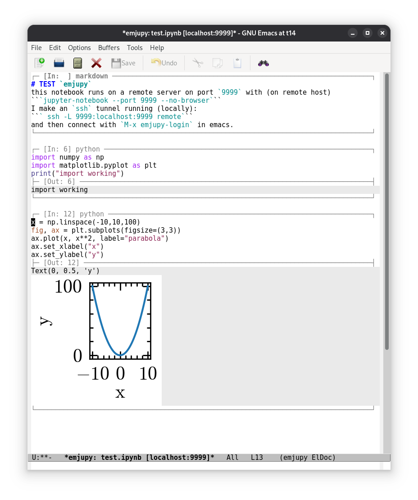

#+TITLE: Emjupy
#+author: Mathieu Renzo w/ various LLMs (Claude Sonnet, Opus, Gemini, chatGPT)

#+CAPTION: Python Jupyter Notebook in Emacs.
#+ATTR_HTML: :width 50%

Jupyter notebooks with remote kernel execution using emacs built-ins
(=eglot= and =tramp=, completion frameworks like =vertico= + =corfu= +
=orderless=) while maintaining compatibility with standard =*.ipynb= for
sharing with non-emacs users.

* Features
- persistent kernel session (to load large dataset once and re-use
  them)
- in-line rendering of output including images
- automatic loading of kernel from port (either local port or remote
  provided from ssh-tunnel), python environment (including for
  =eglot=)
- resilient to connection drops (remote kernel keeps running,
  reconnect emacs)
- =ein=-like workflow and key bindings
- notebook (open and available) and kernel list with =emjupy-list-*=,
  analogous to =ein:notebooklist=

* Try it with =emacs -Q=
To test this in an isolated environment without touching your current config:

1. Launch a =jupyter-notebook= on a known =<PORT>=:
   #+begin_src bash
     jupyter-notebook --port=<PORT> --no-browser
   #+end_src

2. *Optional*: if the server is on a remote machine, if so, ssh into the
   remote machine and create a tunnel to it running on your local
   machine:
   #+begin_src bash
     ssh -L <PORT>:localhost:<PORT> <remote machine>
   #+end_src

3. Launch Emacs with:
   #+begin_src bash
     emacs -Q -L . -l quicktry.el
   #+end_src
   where =-Q= ignores your setup of emacs, =-L .= installs *locally* the
   requirements (to not clutter your emacs installation).

4. Run =emjupy-login= and give it the port. That is the whole prompt:
   the token is only asked for if the server actually needs one. emjupy
   adopts the kernel already running behind that port and shows you the
   notebook list; picking one drops you straight into that live REPL.

On a plain =emacs= installation, you should see something like:

#+CAPTION: simple notebook rendering in a fresh emacs with no customization. Screenshot may be out of date.
#+DOWNLOADED: screenshot @ 2026-09-06 11:03:14

* Installation

Add to load-path this repo and load it:

#+BEGIN_SRC elisp
  (add-to-list 'load-path "/path/to/emjupy")
  (require 'emjupy)
#+END_SRC

* Keybindings

** =emjupy-mode= (notebook buffers)

| Key         | Command                           | Effect                                                            |
|-------------+-----------------------------------+-------------------------------------------------------------------|
| =C-c C-c=     | =emjupy-execute-cell-at-point=      | Execute the cell at point, leaving point where it is              |
| =M-RET=       | =emjupy-execute-cell-and-goto-next= | Execute the cell and move to the next one                         |
| =C-c C-r=     | =emjupy-execute-cell-and-goto-next= | Same as =M-RET=                                                     |
| =C-c C-a=     | =emjupy-insert-cell-above=          | Insert a new code cell above the current one                      |
| =C-c C-b=     | =emjupy-insert-cell-below=          | Insert a new code cell below the current one                      |
| =C-c C-k=     | =emjupy-delete-cell=                | Delete the cell at point                                          |
| =C-c C-t=     | =emjupy-cycle-cell-type=            | Toggle the cell between code and markdown                         |
| =M-<up>=      | =emjupy-move-cell-up=               | Move the cell one position earlier                                |
| =M-<down>=    | =emjupy-move-cell-down=             | Move the cell one position later                                  |
| =C-c '=       | =emjupy-edit-cell-externally=       | Edit the cell in the shadow buffer in a real major mode           |
| =C-c C-n=     | =emjupy-next-cell=                  | Move point to the next cell                                       |
| =M-n=         | =emjupy-next-cell=                  | Same as =C-c C-n=                                                   |
| =C-c C-p=     | =emjupy-previous-cell=              | Move point to the previous cell                                   |
| =M-p=         | =emjupy-previous-cell=              | Same as =C-c C-p=                                                   |
| =C-x C-s=     | =emjupy-save-notebook=              | Write the notebook back to the server as nbformat v4              |
| =C-c C-s=     | =emjupy-save-notebook=              | Same as =C-x C-s=                                                   |
| =C-c C-z=     | =emjupy-connect-kernel-interactive= | Pick a running kernel or spawn one, for this notebook only        |
| =C-c C-x C-r= | =emjupy-restart-kernel=             | Restart this notebook's kernel; other notebooks are untouched     |
| =C-c C-x C-c= | =emjupy-reconnect-kernel=           | Reopen the socket to the same kernel after a drop; state survives |
| =C-c C-x b=   | =emjupy-switch-notebook=            | Switch to another open notebook, labelled by server               |
| =C-c C-x s=   | =emjupy-status=                     | List every open notebook with its server and kernel               |
| =C-c C-x l=   | =emjupy-login=                      | Log in to another server (another ssh tunnel)                     |

** =emjupy-shadow-edit-mode= (the =C-c '= buffer)

| Key     | Command                   | Effect                                              |
|---------+---------------------------+-----------------------------------------------------|
| =C-c C-c= | =emjupy-commit-shadow-edit= | Write edits back into the notebook cells and return |
| =C-c '=   | =emjupy-commit-shadow-edit= | Same as =C-c C-c=                                     |
| =C-c C-k= | =emjupy-abort-shadow-edit=  | Discard edits and return to the notebook            |

Note that =C-c C-k= means /delete cell/ in the notebook but /abort edit/ in
the shadow buffer, while =C-c C-c= and =C-c '= behave the same in both.

** Unbound commands (=M-x= only)

| Command                   | Effect                                           |
|---------------------------+--------------------------------------------------|
| =emjupy-open-notebook=      | Open a notebook by path on a given server        |
| =emjupy-list-notebooks=     | Prompt with the server's notebook list           |
| =emjupy-create-notebook=    | Create a new blank notebook on the server        |
| =emjupy-refresh-appearance= | Re-derive page colours from the theme and redraw |

Completion (=M-TAB=) and eldoc need no emjupy binding: they are wired into
the standard hooks and reach the language server through the shadow buffer
automatically.

* Building & development

=emjupy= is a multi-file Emacs package. To build a tar and install it:

#+begin_src bash
make package                 # -> emjupy-0.1.0.tar
make install                 # package-install-file into your Emacs
#+end_src

and install from Emacs: =M-x package-install-file RET emjupy-0.1.0.tar RET=.

The only external dependency is =websocket= (1.15+); Emacs 29.1+ is
required. =emjupy-login= is autoloaded, so =M-x emjupy-login= works
without any =require=.

** Source layout

| File               | Contains                                                |
|--------------------+---------------------------------------------------------|
| =emjupy.el=          | major mode, keymap, entry point                         |
| =emjupy-core.el=     | structs, state, server registry, lookups                |
| =emjupy-http.el=     | REST transport, URL/scheme/base-path parsing            |
| =emjupy-render.el=   | faces, page colours, cell outlines, syntax highlighting |
| =emjupy-cells.el=    | buffer<->struct syncing and cell editing commands       |
| =emjupy-kernel.el=   | kernel WebSocket, execution, message routing            |
| =emjupy-notebook.el= | login/session management, .ipynb parse and serialize    |
| =emjupy-eglot.el=    | shadow buffer, completion, eldoc                        |
| =emjupy-pkg.el=      | package metadata                                        |

Dependencies run one way: =core -> render -> cells -> kernel -> notebook=, with
=eglot= on top of =cells=. The two genuine cycles (=emjupy-mode= and
=emjupy--rerender-notebook=) are runtime-only and marked with
=declare-function=.

** Makefile targets

| Target       | Effect                                                  |
|--------------+---------------------------------------------------------|
| =make compile= | byte-compile all sources in dependency order            |
| =make test=    | run the suite (integration tests skip without a server) |
| =make check=   | same, with the integration environment set              |
| =make package= | build =emjupy-VERSION.tar=                                |
| =make install= | install that tar via =package-install-file=               |
| =make clean=   | remove =.elc= files and the tar                           |

** Unit tests

The self-contained suite requires only =websocket=:

#+begin_src bash
emacs -batch -Q -L . -l emjupy-run-tests.el
#+end_src

=websocket= is resolved from =load-path= first, then from
=EMJUPY_WEBSOCKET_DIR=, and only then from GNU ELPA -- so the suite
also runs offline / in CI:

#+begin_src bash
EMJUPY_WEBSOCKET_DIR=/path/to/emacs-websocket \
  emacs -batch -Q -L . -l emjupy-run-tests.el
#+end_src

** Integration tests (real server, real kernel, real LSP)

=emjupy-integration-test.el= talks to a live Jupyter server and runs
real Python in a real kernel. These are opt-in and =ert-skip= unless
the environment points at a running server, so the default run stays
fast and hermetic.

Some things only break against a live server -- an image arriving that
this Emacs cannot display, a WebSocket URL that drops its base path, a
saved notebook no other tool will open -- so they are worth running
before trusting a change.

| Variable           | Meaning                                                   |
|--------------------+-----------------------------------------------------------|
| =EMJUPY_TEST_URL=    | =host:port= of a running server (the LOCAL end of a tunnel) |
| =EMJUPY_TEST_TOKEN=  | its token                                                 |
| =EMJUPY_TEST_ROOT=   | server root dir, for the nbformat-validation test         |
| =EMJUPY_TEST_URL2=   | a SECOND server, for the multi-server tests               |
| =EMJUPY_TEST_TOKEN2= | its token (defaults to =EMJUPY_TEST_TOKEN=)                 |

To exercise the *remote* path, point =EMJUPY_TEST_URL= at the local end
of an ssh tunnel rather than at the server directly:

#+begin_src bash
# server side: jupyter listens only on loopback
jupyter server --no-browser --port=8888 --ip=127.0.0.1 --IdentityProvider.token=abc

# client side: forward a local port through ssh
ssh -N -L 18888:127.0.0.1:8888 user@remote-host &

EMJUPY_TEST_URL=127.0.0.1:18888 EMJUPY_TEST_TOKEN=abc \
EMJUPY_TEST_ROOT=/path/to/notebook/root \
  emacs -batch -Q -L . -l emjupy-run-tests.el
#+end_src

The eglot tests additionally need a Python language server on =PATH=
(=pylsp=, =pyright-langserver= or =jedi-language-server=); they skip if
none is found.

* Landscape of other emacs/jupyter packages

| Package       | Approach          | Limitations                                                                                           |
|---------------+-------------------+-------------------------------------------------------------------------------------------------------|
| =ein=           | HTTP + WebSocket  | Sunset 2023; polymode + overlay; no undo; no eglot                                                    |
| =emacs-jupyter= | ZMQ directly      | depends on =emacs-zmq= (dynamic module); can't connect via HTTP tunnel; notebook server hides ZMQ ports |
| =ob-jupyter=    | Org-babel wrapper | Not .ipynb-compatible; no notebook list UI                                                            |

** Key insight: use the browser's transport, not ZMQ

When you run =jupyter notebook --no-browser --port=8888=, the server exposes:

- =GET  /api/kernels=          \rightarrow list running kernels
- =POST /api/kernels=          \rightarrow start a kernel
- =GET  /api/sessions=         \rightarrow list sessions (kernel ↔ notebook pairs)
- =POST /api/sessions=         \rightarrow create/attach session
- =GET  /api/contents=         \rightarrow list notebooks
- =GET  /api/contents/<path>=  \rightarrow fetch notebook JSON
- =PUT  /api/contents/<path>=  \rightarrow save notebook JSON
- =WS   /api/kernels/<id>/channels= \rightarrow Jupyter wire protocol over WebSocket

This is exactly what every browser-based client (JupyterLab, Classic Notebook)
uses. It works transparently through an SSH tunnel, survives reconnects, and
requires only =url.el= (built-in) and =websocket.el= (GNU ELPA, zero C deps).

** Multiple notebooks and multiple servers

One port = one kernel. Each server owns its token and its XSRF cookie; a notebook owns its
kernel; a kernel owns its WebSocket and its table of in-flight
requests. So you can keep several notebooks open at once, from several
servers at once -- typically several ssh tunnels on different local
ports.

Run =emjupy-login= once per tunnel:

#+begin_src
M-x emjupy-login RET 18888 RET     ;; tunnel to machine A
M-x emjupy-login RET 19999 RET     ;; tunnel to machine B
#+end_src

The typical workflow this is built around:

1. On the remote host, start a notebook kernel on port X.
2. Locally, =ssh -L X:127.0.0.1:X user@remote=.
3. =M-x emjupy-login RET X RET=.

emjupy adopts the kernel already running behind that port rather than
spawning a second one next to it, so opening a notebook puts you in the
REPL you started. A port with nothing running gets a fresh kernel; a
port with several asks which one.

Each port keeps its own kernel, so several remote sessions stay live in
one Emacs. Use =C-c C-z= to give an individual notebook a different
kernel. Logging in again to a server you already know updates its token
and keeps the same object, so notebooks already pointing at it stay
valid.

The token is resolved without bothering you where possible: an explicit
argument, else the token already registered for that server, else no
token at all (common for tunnelled servers started with
=--IdentityProvider.token=), and only then a prompt. =C-u M-x emjupy-login=
always prompts.

Notebook buffers are named =*emjupy: PATH [SERVER]*=, because the same
path can exist on two servers and one buffer cannot stand for both. The
Eglot shadow file is qualified the same way, so two servers hosting
=analysis.ipynb= don't clobber each other's code.

=C-c C-z= marks kernels already driving another open notebook as =[in
use]=: attaching two notebooks to one kernel makes them share
interpreter state, which is occasionally what you want and usually not.

=emjupy-reconnect-kernel= is the connection-drop path: when a tunnel
dies the remote kernel keeps running, so only Emacs's socket needs
re-establishing and your session state survives.

* Rendering notes

** Cell appearance

Cells are marked out by their horizontal rules alone -- the buffer keeps
its normal background throughout.  The one exception is a cell's
*output*, which gets a faint background band so results are
distinguishable from the code that produced them.  The band lives on the
output overlay, so when the outputs are cleared and the box shrinks the
background goes with them.

=emjupy-output-color= sets that band.  It defaults to ='auto=, which
blends the buffer background =emjupy-output-blend= (8%) of the way
toward the foreground: darker on a light theme, lighter on a dark one,
and tinted by the theme rather than a flat neutral grey.  Theme switches
are followed automatically.

#+begin_src elisp
(setq emjupy-output-color "#f0f0f0")   ;; pin a colour
(setq emjupy-output-color nil)         ;; no band at all
#+end_src

The band fills each output line edge to edge -- the =emjupy-output= face
sets =:extend t=, without which a face's background stops at the last
character and short lines look ragged beside long ones.

=M-x emjupy-refresh-appearance= re-derives the colour and redraws.  The
faces are =emjupy-output= (the band) and =emjupy-box-line= (the rules).

** Undo

Re-rendering erases the buffer and rebuilds it from the cell structs, so
it is kept out of the undo history entirely -- as a recorded change it
is both enormous and meaningless to undo.

Because the rebuild is invisible to undo, entries recorded before it
refer to a buffer layout that no longer exists, so they are dropped when
a rebuild actually changed the text.  Undo therefore stops at the last
render instead of corrupting the notebook.  A re-render that produces
identical text leaves the history alone.

** Cell outlines

The rule that outlines each cell is sized by =emjupy-box-width=. The
default, ='window=, fits it to the window, so the outline spans a wide
frame instead of stopping short at a fixed 80 columns. Set it to an
integer for a fixed width, and =emjupy-box-min-width= is the floor when
fitting.

Outlines follow the window as it changes: splitting, dragging a mode
line or toggling full screen all redraw the rules at the new width, so
they never wrap onto a second line. Only the overlay strings are
rebuilt, not the buffer text, so point, markers and the undo history
are untouched. When the buffer is shown in two windows at once the
*narrower* one wins, since a rule sized for the wide window would wrap
in the narrow one.

** Markdown highlighting

Markdown cells are highlighted out of the box -- headings, emphasis,
inline code and fences, links, list markers and blockquotes -- with no
external package. =markdown-mode= and =markdown-ts-mode= are MELPA
packages emjupy does not depend on; when one of them IS installed it is
used in preference to the built-in approximation.

** Inline images need a graphical Emacs

Images are only drawn when the running Emacs can actually display them
(=display-graphic-p= *and* =image-type-available-p=). On a terminal
frame or an image-less build (=emacs-nox= is the common case),
=create-image= *signals* rather than degrading, and because rendering
happens inside the WebSocket callback -- where =websocket.el= swallows
errors -- the old behaviour was a silently blank output box. emjupy now
falls back to the bundle's own =text/plain= repr plus a short note
saying why there is no picture.

Supported inline types: =image/png=, =image/jpeg=, =image/gif= and
=image/svg+xml=.

** Duplicate figures

A cell whose last expression is a figure receives the same picture
twice from the kernel: once as the =execute_result= repr and again as
the inline backend's =display_data=. That is kernel-side behaviour, so
emjupy drops the repeat at *render* time only -- the cell's outputs, and
the =.ipynb= written back, still contain exactly what the kernel sent,
keeping the file faithful for other clients. Set
=emjupy-deduplicate-image-outputs= to =nil= to draw both.

* Eglot commands in a notebook

Completion and eldoc reach the language server through a hidden shadow
buffer holding the notebook's code.  Eglot's own commands did not: they
call =eglot--current-server-or-lose=, and the notebook buffer is not the
one Eglot manages, so =M-x eglot-rename= failed with a bare "No current
JSON-RPC connection".

The commands in =emjupy-eglot-delegated-commands= -- =eglot-rename=,
=eglot-code-actions=, =eglot-format= and the =eglot-find-*= family -- now run
in the shadow buffer at the position matching point, with any edits
pulled back into the cells.  Because that buffer holds every cell at
once, a rename fixes references in *all* of them, not only the cell
point was in.

The advice does nothing outside =emjupy-mode=; =M-x
emjupy-eglot-remove-advice= takes it off entirely.

* Server dashboard

=M-x emjupy-server-dashboard= (also =emjupy-notebook-list=) opens one buffer
per server showing what it has: the kernels running on it and the
notebooks stored on it, browsable into subdirectories.

| Key   | Effect                                        |
|-------+-----------------------------------------------|
| =RET=   | open the notebook, or descend into the folder |
| =^=     | up a directory (the =..= row)                   |
| =g=     | re-fetch from the server                      |
| =k=     | shut down the kernel on this line             |
| =K=     | shut down every kernel on this server         |
| =n=     | create a notebook in the folder being shown   |
| =d=     | hand this directory to Dired                  |

It is built on =tabulated-list-mode=, so sorting and navigation are
Emacs's own.  It is deliberately *not* a file manager: =d= hands the
directory to Dired, over TRAMP when the server is remote.  The Contents
API says what notebooks exist but not how to reach them as files -- and a
tunnelled server looks like localhost from here -- so tell emjupy where
they live:

#+begin_src elisp
(setq emjupy-remote-root "/ssh:user@host:/home/user/notebooks")
;; or per server:
(setq emjupy-remote-root
      \='(("localhost:8888" . "~/notebooks")
        ("localhost:9999" . "/ssh:box:/srv/nb")))
#+end_src

* Jumping to definitions

=M-.= works inside a notebook.  Eglot installs its xref backend in the
buffer it manages -- the hidden shadow buffer, not the notebook -- so
emjupy adds a backend that forwards there and maps the answer back.

Because the shadow buffer holds every cell at once, a jump crosses
cells: =M-.= on a call in one cell lands on the definition in another.
Locations pointing anywhere else, into a library say, are left alone,
because the real file is the right destination there.

* Known limitations

Multi-cursor: Works fine editing within one cell while nothing else is
happening. multiple-cursors.el places its fake-cursor overlays on real
buffer text (the box-drawing borders are display-only overlay strings,
not actual characters, so they don't interfere), and a normal edit
session applies correctly to all cursor positions. The catch:
emjupy-mode rebuilds the entire buffer (erase-buffer + reinsert) any
time a cell executes, gets inserted/deleted/moved, or — critically —
any time another cell's output streams in. Fake-cursor overlays
collapsed to buffer position 1, and the next multi-cursor edit
produced genuinely garbled text (!! at the start of the buffer, a
stray ! landing inside unrelated text).

So: safe for a focused burst of multi-cursor edits in one cell. Unsafe
if a background cell might finish or stream output while you're doing
it — which is a real risk in a notebook, since that's the normal way a
long-running cell behaves. In the shadow buffer (C-c '), none of this
applies — it's a plain, ordinary buffer that never gets torn down, so
multi-cursor is fully safe there. That's the actual reason I'd steered
you toward it for heavier editing earlier, now with a concrete
mechanism behind the claim rather than just a hunch.

* TODO fixes needed

- [X] =undo= scrambles everything if undoing something in another cell:
  rendering issue? :rendering:
- [X] fix highlighting/background :rendering:
  - [X] syntax highlighting is at cell execution, not while typing
  - [X] wrong background color
- [X] fix remote server eglot error, from *Messages* buffer:
  #+BEGIN_SRC
  eglot--current-server-or-lose: jsonrpc-error: "No current JSON-RPC connection", (jsonrpc-error-code . -32603), (jsonrpc-error-message . "No current JSON-RPC connection")
  #+END_SRC
- [X] add =emjupy-kill-kernel= function
- [X] add =emjupy-notebook-list=
- [ ] latex rendering in =markdown= cells
- [ ] widgets with external thing?
