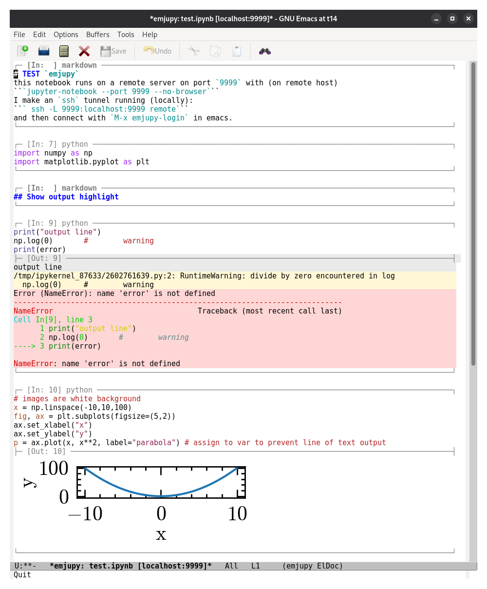
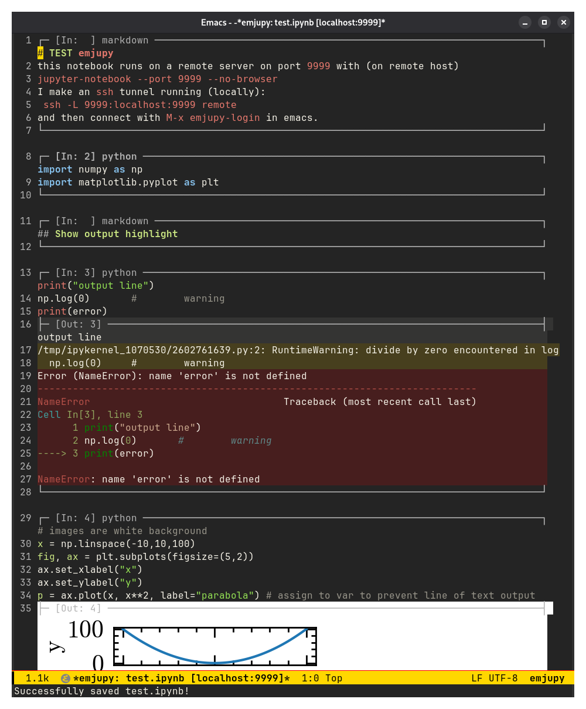

#+TITLE: Emjupy
#+author: Mathieu Renzo w/ Claude:Opus 5

[[https://github.com/mathren/emjupy/actions/workflows/build-package.yml][https://github.com/mathren/emjupy/actions/workflows/build-package.yml/badge.svg]]
[[https://mathren.github.io/emjupy/][https://img.shields.io/badge/docs-online-green.svg]]
[[https://codecov.io/gh/mathren/emjupy][https://codecov.io/gh/mathren/emjupy/graph/badge.svg]]
[[https://www.gnu.org/licenses/gpl-3.0][https://img.shields.io/badge/License-GPL%20v3-blue.svg]]
[[https://melpa.org/#/emjupy][https://melpa.org/packages/emjupy-badge.svg]]

#+CAPTION: Python Jupyter Notebook in Emacs.
#+ATTR_HTML: :width 50%

Jupyter notebooks with remote kernel execution using emacs built-ins
(=eglot= and =tramp=, completion framework the way you like and
configured, e.g., =vertico= + =corfu= + =orderless= + =xref= + =eldoc=) while
maintaining compatibility with standard =*.ipynb= for sharing with
non-emacs users.

* Screenshots

On a plain emacs installation, you should see something like:
#+CAPTION: [[./test_notebook/test.ipynb][Simple notebook]] rendering in a fresh emacs with no customization. Screenshot may be out of date.
#+DOWNLOADED: screenshot @ 2026-09-06 12:42:46

This is what the same notebook looks like with =wombat= theme in my
setup:
#+CAPTION: simple notebook rendering in [[https://github.com/mathren/emacs_mathren][my emacs]] with a slightly modified =wombat= dark theme.
#+DOWNLOADED: screenshot @ 2026-09-06 12:49:08

*N.B.:* Screenshot may be out of date.

* Features
- persistent kernel session (to load large dataset once and re-use
  them)
- remote or local kernel (just needs port and token)
- in-line rendering of output including images
- automatic loading of kernel from port, python environment (including
  for =eglot= if =python-lsp-server= is listed in the environment)
- resilient to connection drops (remote kernel keeps running,
  reconnect emacs)
- toggle hide/show output without re-running cells
- =ein=-like workflow and key bindings
- =emjupy-notebook-list= similar to =ein:notebooklist= allows to navigate
  notebook and adjacent files

* Try it with =emacs -Q=
To test this in an isolated environment without touching your current config:

1. Launch a =jupyter-notebook= on a known =<PORT>=:
   #+begin_src bash
     jupyter-notebook --port=<PORT> --no-browser  --IdentityProvider.token=abc
   #+end_src
   This can optionally be done on a remote machine.

2. *Optional*: if the server is on a remote machine, create a tunnel to
   it running on your local machine:
   #+begin_src bash
     ssh -L <PORT>:localhost:<PORT> <remote machine>
   #+end_src

3. Launch Emacs from within the =src/= directory with:
   #+begin_src bash
     cd src/
     emacs -Q -L . -l quicktry.el
   #+end_src
   where =-Q= ignores your setup of emacs, =-L .= installs *locally* the
   requirements (to not clutter your emacs installation).

4. Follow the prompt in the minibuffer (bottom) area. The
   token/password is =abc= provided in 1., only asked if the server
   actually needs one. =emjupy= adopts the kernel already running behind
   that port and shows you the notebook list; picking one drops you
   straight into the live REPL (see screenshots above).

* Installation

Clone this repo, add to =load-path=, and load it with these lines in
your =init.el= or similar:

#+BEGIN_SRC elisp
  (add-to-list 'load-path "/path/to/emjupy")
  (require 'emjupy)
#+END_SRC

Or with =use-package= (remove the =:rev :newest= line to use the latest
release rather than the latest commit):

#+BEGIN_SRC elisp
  (use-package emjupy
    :vc (:url "https://github.com/mathren/emjupy"
         :rev :newest ;; latest commit, if commented, latest release
         )
    :config
    (setq emjupy-render-latex t))
#+END_SRC

Alternatively, use =install-package-file= giving it the tarball you can
create with =make package= (see [[file:docs/development.org::+TITLE: Building and development][Building & development]]).

* Landscape of other emacs/jupyter packages

| Package       | Approach          | Limitations                                                                                           |
|---------------+-------------------+-------------------------------------------------------------------------------------------------------|
| =ein=           | HTTP + WebSocket  | Sunset 2023; polymode + overlay; per-cell undo; no eglot                                              |
| =emacs-jupyter= | ZMQ directly      | depends on =emacs-zmq= (dynamic module); can't connect via HTTP tunnel; notebook server hides ZMQ ports |
| =ob-jupyter=    | Org-babel wrapper | Not .ipynb-compatible; no notebook list UI                                                            |
|---------------+-------------------+-------------------------------------------------------------------------------------------------------|
| =emjupy=        | HTTP + WebSocket  | Python only (other kernels untested); needs =jupyter-lsp= on the server for eglot; Emacs 30.1+          |

=ein= was my working tool for more than a decade, but it is
[[https://github.com/millejoh/emacs-ipython-notebook][unmaintained]], and the use of =polymode= makes it hard to use =eglot=. I
need to share code with non-emacs users, so =ob-jupyter= isn't an
option, and =emacs-jupyter= doesn't seem the right tool for me.

* Documentation

The full documentation lives in [[file:docs/index.org][docs/]]:

- [[file:docs/keybindings.org][Keybindings]]
- [[file:docs/usage.org][Using a notebook]]
- [[file:docs/appearance.org][Appearance]]
- [[file:docs/remote.org][Working with a remote server]]
- [[file:docs/language-server.org][Language server support]]
- [[file:docs/troubleshooting.org][Troubleshooting]]
- [[file:docs/design.org][How it works]]
- [[file:docs/development.org][Building and development]]
- [[file:docs/limitations.org][Known limitations]]
- [[file:docs/todo.org][TODO list of improvements]]
