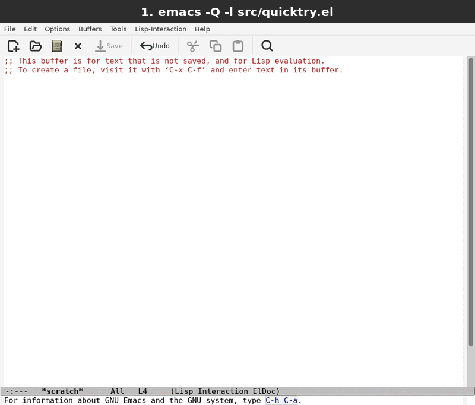

#+TITLE: Emjupy
#+author: Mathieu Renzo w/ Claude:Opus 5

[[https://github.com/mathren/emjupy/actions/workflows/build-package.yml][https://github.com/mathren/emjupy/actions/workflows/build-package.yml/badge.svg]]
[[https://mathren.github.io/emjupy/][https://img.shields.io/badge/docs-online-green.svg]]
[[https://codecov.io/gh/mathren/emjupy][https://codecov.io/gh/mathren/emjupy/graph/badge.svg]]
[[https://www.gnu.org/licenses/gpl-3.0][https://img.shields.io/badge/License-GPL%20v3-blue.svg]]
[[https://melpa.org/#/emjupy][https://melpa.org/packages/emjupy-badge.svg]]

#+CAPTION: Python Jupyter Notebook in Emacs.
#+ATTR_HTML: :width 50%
[[./html-content/images/emjupy-logo.png]]

=emjupy= edits and runs Jupyter notebooks in Emacs. It talks to a
running Jupyter server over the same HTTP and WebSocket API the
browser uses, so a kernel on another machine works through an ssh
tunnel, and the notebook stays a standard =.ipynb= that any other
Jupyter tool opens. Completion, documentation and =M-.= come through
=eglot=, from a language server running beside the kernel.

It uses Emacs's own tools -- =eglot=, =xref=, =eldoc=, =tramp= -- with
whatever completion setup you already have (=vertico=, =corfu=,
=orderless= or anything else).

Interactive plots and widgets can be shown in an external window or
browser (see [[file:docs/usage.org::*Interactive output][Interactive output]] and [[file:docs/appearance.org::*Gifs and Screenshots gallery][Gifs and Screenshots gallery]]).

* Try it in under 2 minutes with =emacs -Q=...

...without touching your own Emacs configuration.

#+CAPTION: The steps below in  =emacs -Q= (version 30.1).
#+ATTR_HTML: :width 75%

The repository ships a small notebook, =test_notebook/test.ipynb=, with
a module beside it, so there is something real to run. To test with
your own notebooks, jump to step 4.

1. *Get emjupy.*
   #+begin_src bash
     git clone https://github.com/mathren/emjupy
     cd emjupy
   #+end_src

2. *A Python environment with Jupyter.*  Either create the one the
   notebook comes with,
   #+begin_src bash
     conda env create -f test_notebook/environment.yml
     conda activate test_emjupy
   #+end_src
   or install into one you have:
   #+begin_src bash
     pip install jupyter-server ipykernel jupyter-lsp 'python-lsp-server[all]' matplotlib numpy tqdm
   #+end_src
   =jupyter-lsp= and =python-lsp-server= are what give completion,
   documentation and =M-.=; without them everything else still works.

3. *Start a server* in the notebook's directory, in its own terminal:
   #+begin_src bash
     cd test_notebook
     jupyter server --no-browser --port=8888 --IdentityProvider.token=abc
   #+end_src
   The server can equally run on another machine -- started the same
   way, in a copy of =test_notebook/= or any directory with notebooks.
   Then forward its port from this one, and use the same port below:
   #+begin_src bash
     ssh -N -L 8888:localhost:8888 <remote machine>
   #+end_src

4. *Start Emacs* from the repository root:
   #+begin_src bash
     emacs -Q -l src/quicktry.el
   #+end_src
   =-Q= leaves your own configuration out; =quicktry.el= puts emjupy on
   the load path and installs its one dependency, =websocket.el=, into a
   temporary package directory, so nothing in your setup is touched.

5. *Log in*: =M-x emjupy-login RET 8888 RET=, and =abc= when asked for the
   token.  Pick =test.ipynb= from the list.

6. *Try it*:
   - =C-c C-c= runs the cell at point and moves to the next;
   - =M-.= on =example_function= jumps to its definition in =library.py=;
   - =C-c C-v= shows every command, grouped by what it is for.

** Features
- persistent kernel session (to load large dataset once and re-use
  them)
- remote or local kernel (just needs port and token)
- in-line rendering of output including images
- adopts the kernel already running behind a port, and the Python
  environment it runs in
- completion, documentation and =M-.= through =eglot=, from a language
  server running beside the kernel via =jupyter-lsp=
- resilient to connection drops (remote kernel keeps running,
  reconnect emacs)
- toggle hide/show output without re-running cells
- =ein=-like workflow and key bindings
- =emjupy-notebook-list= similar to =ein:notebooklist= allows to navigate
  notebook and adjacent files

* Installation

Clone this repo, add its =src/= directory to =load-path=, and load it
with these lines in your =init.el= or similar:

#+BEGIN_SRC elisp
  (add-to-list 'load-path "/path/to/emjupy/src")
  (require 'emjupy)
#+END_SRC

=websocket.el= must be installed too, from GNU ELPA or MELPA.

Or with =use-package= (remove the =:rev :newest= line to use the latest
release rather than the latest commit):

#+BEGIN_SRC elisp
  (use-package emjupy
    :vc (:url "https://github.com/mathren/emjupy"
         :lisp-dir "src"
         :rev :newest)
    :config
    (setq emjupy-render-latex t))
#+END_SRC

=:lisp-dir "src"= is needed: the sources are in =src/=, and without it
the package installs but =emjupy= cannot be loaded.

Alternatively, =M-x package-install-file= on the tarball =make package=
builds (see [[file:docs/development.org][Building & development]]).

* Landscape of other emacs/jupyter packages

| Feature                                                           | =emjupy=       | =ein= | =emacs-jupyter= | =ob-jupyter= |
|-------------------------------------------------------------------+--------------+-----+---------------+------------|
| Notebook-style buffer of cells                                    | ✓            | ✓   | ✗             | ✗          |
| Reads and writes standard =.ipynb=                                  | ✓            | ✓   | ✗             | ✗          |
| Notebook list UI                                                  | ✓            | ✓   | ✗             | ✗          |
| Interactive widgets                                               | ✓ (external) | ✗   | ?             | ?          |
| Kernel via Jupyter server HTTP + WebSocket (ssh tunnel is enough) | ✓            | ✓   | ✓             | ✓          |
| No =emacs-zmq= dynamic module required                              | ✓            | ✓   | ✗             | ✗          |
| =eglot= (completion, =M-.=, rename across cells)                      | ✓            | ✗   | ✗             | ✗          |
| Kernels other than Python                                         | ✗            | ✓   | ✓             | ✓          |

✓ = supported, ✗ = not supported (checked <2026-10-02 Fri>).

The packages differ mainly in what they edit and how they reach the
kernel. =ein= and =emjupy= edit =.ipynb= notebooks in a buffer of cells over
the HTTP and WebSocket API of a Jupyter server, which is why an ssh
tunnel is enough. =emacs-jupyter= is a kernel client built around a REPL
and Org-babel source blocks, so it has no notebook buffer and does not
read =.ipynb=. Its ZMQ transport needs the =emacs-zmq= dynamic module and
cannot reach the kernels behind a notebook server, although it can
also talk to a server's REST API through TRAMP-style
=/jpy:host#port:name= names. In exchange for notebook-level =eglot=
integration, =emjupy= is Python only (other kernels untested), needs
=jupyter-lsp= on the server, and requires Emacs 30.1+.

=ein= was my working tool for more than a decade, but it is
[[https://github.com/millejoh/emacs-ipython-notebook][unmaintained]], and the use of =polymode= makes it hard to use =eglot=. I
need to share code with non-emacs users, so =ob-jupyter= isn't an
option, and =emacs-jupyter= doesn't seem the right tool for me.

* Documentation

The full documentation lives in [[file:docs/index.org][docs/]]:

- [[file:docs/keybindings.org][Keybindings]]
- [[file:docs/usage.org][Using a notebook]]
- [[file:docs/appearance.org][Appearance]]
- [[file:docs/remote.org][Working with a remote server]]
- [[file:docs/language-server.org][Language server support]]
- [[file:docs/troubleshooting.org][Troubleshooting]]
- [[file:docs/design.org][How it works]]
- [[file:docs/development.org][Building and development]]
- [[file:docs/limitations.org][Known limitations]]
- [[file:docs/todo.org][TODO list of improvements]]
